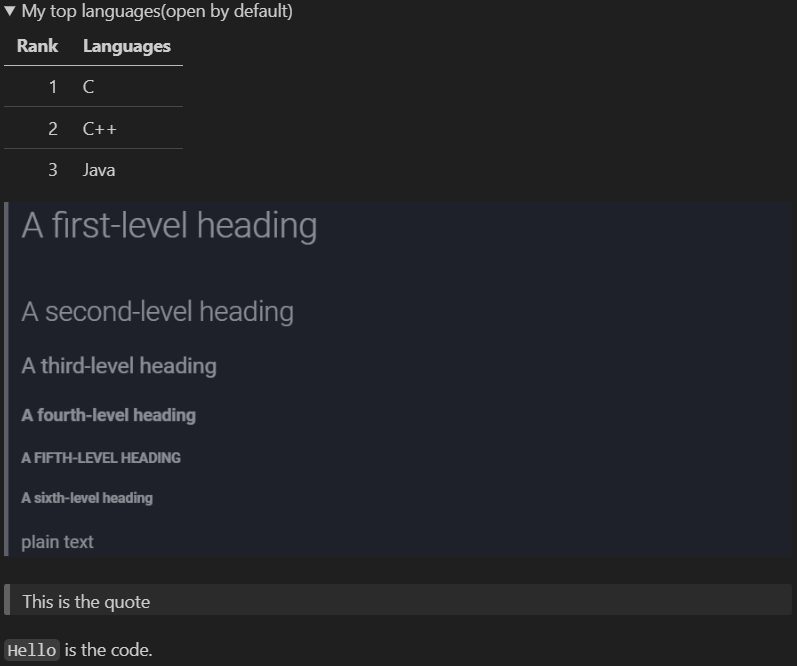
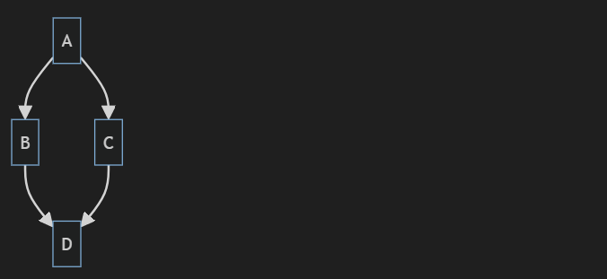
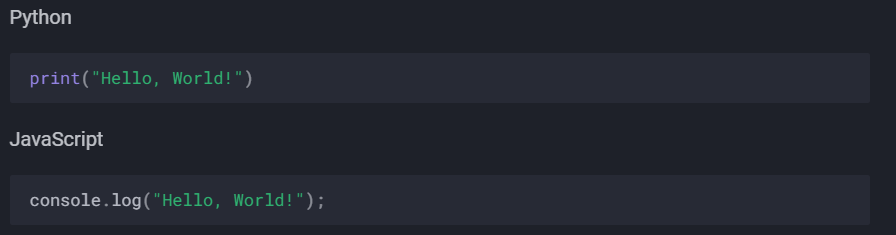

# Basic writing and formatting syntax

Create sophisticated formatting for your prose and code on GitHub with simple syntax.

## Headings

To create a heading, add one to six `#` symbols before your heading text. The number of `#` you use will determine the hierarchy level and typeface size of the heading.

```
# A first-level heading
## A second-level heading
### A third-level heading
#### A fourth-level heading
##### A fifth-level heading
###### A sixth-level heading
```

<!--This is the same as -->

## Styling text

You can indicate emphasis with bold, italic, strikethrough, subscript, or superscript text in comment fields and `.md` files.

 |         Style          |       Syntax       |                 Keyboard shortcut                 |                 Example                  |                 Output                 |
 | :--------------------: | :----------------: | :-----------------------------------------------: | :--------------------------------------: | :------------------------------------: |
 |          Bold          | `** **` or `__ __` | `Command`+`B` (Mac) or `Ctrl`+`B` (Windows/Linux) |         `**This is bold text**`          |         __This is bold text__          |
 |         Italic         |   `* *` or `_ _`   | `Command`+`I` (Mac) or `Ctrl`+`I` (Windows/Linux) |       `_This text is italicized_`        |       *This text is italicized*        |
 |     Strikethrough      |      `~~ ~~`       |                       None                        |       `~~This was mistaken text~~`       |      ~~This was mistaken text~~\*      |
 | Bold and nested italic | `** **` and `_ _`  |                       None                        | `**This text is _extremely_ important**` | __This text is *extremely* important__ |
 |  All bold and italic   |     `*** ***`      |                       None                        |    `***All this text is important***`    |    _**All this text is important**_    |
 |       Subscript        |   `<sub> </sub>`   |                       None                        |   `This is a <sub>subscipt</sub> text`   |   This is a<sub>subscript</sub> text   |
 |      Superscript       |   `<sup> </sup>`   |                       None                        | `This is a <sup>superscript</sup> text`  |  This is a<sup>superscript</sup> text  |

> \*: I don't know why mkdocs doesn't support using `~~ ~~` to apply the strikethrough effect. Maybe this is not compatible with my material theme.

We can use the HTML `<del>` tag to apply the strikethrough effect.

huhuhuhu

|         Style |         Syntax | Keyboard shortcut |                             Example | Output                            |
| ------------: | -------------: | ----------------: | ----------------------------------: | --------------------------------- |
| Strikethrough | `<del> </del>` |              None | `<del>This was mistaken text</del>` | <del>This was mistaken text</del> |

## Quoting text

You can quote text with a `>`.

```
Text that is not a quote

> Text that is a quote
```

Quoted text is indented, with a different type of color.

Text that is not a quote.

> Text that is a quote

> This is a multi-line quote
>
> Second line

> Text that is a quote
>
> This is a multi-line quote
>
> Second line

>__The text with the quote will be formatted__

You can add another quote in a quote just like this:

> This is the quote
> 
> >This is a quote in the quote
> 
> This is the quote
>
> > > This is quote in the quote of the quote
> 
> > This is a quote in the quote
>
> This is the quote
>
> > This is a quote in the quote
>
> > > This is quote in the quote of the quote
> 
> This is the quote
>
> > This is a quote in the quote
>
> This is the quote
>
> > > This is quote in the quote of the quote
>
> This is the quote

You can add a horizontal line before a quote to make the quote more beautiful.

```
---
> This is the quote
```

---
> This is the quote

## Quoting code

You can call out code or a command within a sentence with single backticks. **The text within the backticks will not be formatted.** You can also press the `Command`+`E` (Mac) or `Ctrl`+`E` (Windows/Linux) keyboard shortcut to insert the backticks for a code block within a line of Markdown.

```
Use `git status` to list all new or modified files that haven't yet been committed.
```

Use `git status` to list all new or modified files that haven't yet been committed.

To format code or text into its own distinct block, use triple backticks.

> Some basic Git commands are:
>
> \`\`\`
>
> git status
>
> git add
>
> git commit
>
> \`\`\`

__Some basic Git commands are:__

```bash
git status
git add
git commit
```

To display triple backticks  ``` in a fenced code block, wrap them inside quadruple ```` backticks.

````
```
Look! You can see my backticks.
```
````

## Supported color models

> This feature is only available on GitHub, it will not work on MkDocs

In issues, pull requests and discussions, you can call out colors within a sentence by using backticks. A supported color model within backticks will display a visualization of the color.

```
The background color is `#ffffff` for light mode and `#000000` for dark mode.
```

The background color is `#ffffff` for light mode and `#000000` for dark mode.

Here are the currently supported color models.

| Color |         Syntax |                Example | Output               |
| ----: | -------------: | ---------------------: | -------------------- |
|   HEX |    \`#RRGGBB\` |            \`#0969DA\` | `#0969DA`            |
|   RGB | \`rgb(R,G,B)\` |   \`rgb(9, 105, 218)\` | `rgb(9, 105, 218)`   |
|   HSL | \`hsl(H,S,L)\` | \`hsl(212, 92%, 45%)\` | `hsl(212, 92%, 45%)` |

> Note:
> 
> - A supported color model cannot have any leading or trailing spaces within the backticks.
> 
> - The visualization of the color supported in issues, pull requests, and discussions on GitHub.

## Links

You can create an inline link by wrapping the link in brackets `[ ]`, and wrapping the URL in parentheses `( )`. You can also use the keyboard shortcut `Command`+`K` to create a link. When you have text selected, you can paste a URL from your clipboard to automatically create a link from the selection.

You can also create a Markdown hyperlink by highlighting the text and using the keyboard shortcut `Command`+`V`. If you'd like to replace the text with the link, use the shortcut `Command`+`Shift`+`V`.

`This site was built using [GitHub Pages](https://pages.github.com/).`

This site was built using [GitHub Pages](https://pages.github.com/).

## Section links

You can link directly to a section in a rendered file by hovering over the section heading to expose :link:.

## Relative links

You can define relative links and image paths in your rendered files to help readers navigate to other files in your repository.

A relative link is a link that is relative to the current file. For example, if you have a README file in root of your repository, and you have another file in *docs/CONTRIBUTING.md*, the relative link to *CONTRIBUTING.md* in your README might look like this:

`[Contribution guidelines for this project](docs/CONTRIBUTING.md)`

GitHub will automatically transform your relative link or image path based on whatever branch you're currently on, so that the link or path always works. The path of the link will be relative to the current file. **Links starting with `/` will be relative to the repository root. You can use all relative link operands, such as `./` and `../`.**

> `/` represents the root of the repository
> 
> `./` represents the current path
>
> `../` represents the parent path of the current path
>
> When there are no link operands ahead, it is the same as the link starting with `./`
> 
> Links starting with `/` are **absolute links**.
>
> Links starting with `./` `../` or nothing are **relative links**.
> 
> - Example: `docs/CONTRIBUTING.md` is equivalent to `./docs/CONTRIBUTING.md`
> 
> When you are currently at the root of the repository, these three links are equivalent:
> 
> - `docs/CONTRIBUTING.md`(Current is the root)
> - `./docs/CONTRIBUTING.md`(Same as the last one)
> - `/docs/CONTRIBUTING.md`(Root is current)
> 
> In other cases, `docs/CONTRIBUTING.md` and `/docs/CONTRIBUTING.md` point to different paths, they are not equal

Your link text should be on a single line. The example below will not work.

```
[Contribution 
guidelines for this project](docs/CONTRIBUTING.md)
```

Relative links are easier for users who clone your repository. Absolute links may not work in clones of your repository - we recommend using relative links to refer to other files within your repository.

## Images

You can display an image by adding `!` and wrapping the alt text in `[ ]`. Alt text is a short text equivalent of the information in the image. Then, wrap the link for the image in parentheses `( )`.

``


> Note: When you want to display an image that is in your repository, use relative links instead of absolute links.

Here are some examples for using relative links to display an image.

|                                                     Context | Relative Link                                                          |
| ----------------------------------------------------------: | ---------------------------------------------------------------------- |
|                          In a `.md` file on the same branch | `/assets/images/electrocat.png`                                        |
|                           In a `.md` file on another branch | `/../main/assets/images/electrocat.png`                                |
|     In issues, pull requests and comments of the repository | `../blob/main/assets/images/electrocat.png?raw=true`                   |
|                       In a `.md` file in another repository | `/../../../../github/docs/blob/main/assets/images/electrocat.png`      |
| In issues, pull requests and comments of another repository | `../../../github/docs/blob/main/assets/images/electrocat.png?raw=true` |

> Note: The last two relative links in the table above will work for images in a private repository only if the viewer has at least read access to the private repository that contains these images.

## Specifying the theme an image is shown to

<picture>
  <source media="(prefers-color-scheme: dark)" srcset="https://user-images.githubusercontent.com/25423296/163456776-7f95b81a-f1ed-45f7-b7ab-8fa810d529fa.png">
  <source media="(prefers-color-scheme: light)" srcset="https://user-images.githubusercontent.com/25423296/163456779-a8556205-d0a5-45e2-ac17-42d089e3c3f8.png">
  
</picture>

If your system theme is dark, then you will see a moon with stars above; otherwise, you will see a sun.

What you see only depends on your system settings. Changing the theme of the page by clicking the button at the head of the page will not affect the image above.

The sun and the moon are diaplayed down below:


## Lists

You can make an unordered list by preceding one or more lines of text with `-`, `*`, or `+`.

```
- George Washington
* John Adams
+ Thomas Jefferson
```

- George Washington
* John Adams
+ Thomas Jefferson

To order your list, precede each line with a number.

```
1. James Madison
2. James Monroe
3. John Quincy Adams
```

1. James Madison
2. James Monroe
3. John Quincy Adams

## Nested Lists

You can create a nested list by indenting one or more list items below another item.

To create a nested list using the web editor on GitHub or a text editor that uses a monospaced font, like Visual Studio Code, you can align your list visually. Type space characters in front of your nested list item until the list marker character (`-` or `*`) lies directly below the first character of the text in the item above it.

```
1. First list item
   - First nested list item
     - Second nested list item
```

> Note: In the web-based editor, you can indent or dedent one or more lines of text by first highlighting the desired lines and then using Tab or Shift+Tab respectively.


1. First list item
   - First nested list item
     - Second nested list item

For more examples, see the [GitHub Flavored Markdown Spec](https://github.github.com/gfm/#example-265).

## Task lists

> Add these lines to the `mkdocs.yml` file to add the task lists support:
> ```yml
> markdown_extensions:
>   - pymdownx.tasklist
> ```

To create a task list, preface list items with a **hyphen (-)** and space followed by `[ ]`. To mark a task as complete, use `[x]` or `[X]`.

```
- [x] #739
- [ ] https://github.com/octo-org/octo-repo/issues/740
- [ ] Add delight to the experience when all tasks are complete :tada:
```

- [x] #739
- [ ] https://github.com/octo-org/octo-repo/issues/740
- [ ] Add delight to the experience when all tasks are complete :tada:

If a task list item description begins with a parenthesis, you'll need to escape it with \:

`- [ ] \(Optional) Open a followup issue`

- [ ] \(Optional) Open a followup issue

## Referencing issues and pull requests

> This feature is only available on GitHub, it will not work on MkDocs

@cmw15004431816

## Referencing issues and pull requests

> This feature is only available on GitHub, it will not work on MkDocs

You can bring up a list of suggested issues and pull requests within the repository by typing `#`. Type the issue or pull request number or title to filter the list, and then press either tab or enter to complete the highlighted result.

## Referencing external resources

If custom autolink references are configured for a repository, then references to external resources, like a JIRA issue or Zendesk ticket, convert into shortened links. To know which autolinks are available in your repository, contact someone with admin permissions to the repository.

## Uploading assets

You can upload assets like images by dragging and dropping, selecting from a file browser, or pasting. You can upload assets to issues, pull requests, comments, and `.md` files in your repository.

## Using emojis

You can add emoji to your writing by typing `:EMOJICODE:`, a colon followed by the name of the emoji.

`@octocat :+1: This PR looks great - it's ready to merge! :shipit:`

@octocat :+1: This PR looks great - it's ready to merge! :shipit:

> GitHub and MkDocs support different emojis
>
> For GitHub emojis, please refer to [this link](https://github.com/ikatyang/emoji-cheat-sheet/blob/master/README.md).
>
> For MkDocs emojis, please refer to [this link](https://squidfunk.github.io/mkdocs-material/reference/icons-emojis/#search).

## Paragraphs

You can create a new paragraph by leaving a blank line between lines of text.

## Footnotes

> This feature is only available on GitHub, it will not work on MkDocs

You can add footnotes to your content by using this bracket syntax:

```
Here is a simple footnote[^1].

A footnote can also have multiple lines[^2].

[^1]: My reference.
[^2]: To add line breaks within a footnote, prefix new lines with 2 spaces.
  This is a second line.
```
The footnote will render like this:


Here is a simple footnote[^1].

A footnote can also have multiple lines[^2].

[^1]: My reference.
[^2]: To add line breaks within a footnote, prefix new lines with 2 spaces. <br>This is a second line. You should use the `<br>` tag to switch to a new line in Mkdocs.

> Note: The position of a footnote in your Markdown does not influence where the footnote will be rendered. You can write a footnote right after your reference to the footnote, and the footnote will still render at the bottom of the Markdown.
> 
> Footnotes are not supported in wikis.
>
> Add these lines to your `mkdocs.yml` to add the footnote support.
> 
> ```yml
> markdown_extensions:
>   - footnotes
> ```

## Alerts

> This feature is only available on GitHub, it will not work on MkDocs

Alerts are a Markdown extension based on the blockquote syntax that you can use to emphasize critical information. On GitHub, they are displayed with distinctive colors and icons to indicate the significance of the content.

Use alerts only when they are crucial for user success and limit them to one or two per article to prevent overloading the reader. Additionally, you should avoid placing alerts consecutively. **Alerts cannot be nested within other elements.**

To add an alert, use a special blockquote line specifying the alert type, followed by the alert information in a standard blockquote. Five types of alerts are available:

```
> [!NOTE]
> Useful information that users should know, even when skimming content.

> [!TIP]
> Helpful advice for doing things better or more easily.

> [!IMPORTANT]
> Key information users need to know to achieve their goal.

> [!WARNING]
> Urgent info that needs immediate user attention to avoid problems.

> [!CAUTION]
> Advises about risks or negative outcomes of certain actions.
```

Here are the rendered alerts:


## Hiding content with comments

You can tell GitHub to hide content from the rendered Markdown by placing the content in an HTML comment

`<!-- This content will not appear in the rendered Markdown --->`

<!-- This content will not appear in the rendered Markdown --->

## Ignoring Markdown formatting

You can tell GitHub to ignore (or escape) Markdown formatting by using `\` before the Markdown character.

`Let's rename \*our-new-project\* to \*our-old-project\*.`

Let's rename \*our-new-project\* to \*our-old-project\*.

For more information on backslashes, see Daring Fireball's "[Markdown Syntax](https://daringfireball.net/projects/markdown/syntax#backslash)"

> Note: The Markdown formatting will not be ignored in the title of an issue or a pull request.

## Disabling Markdown rendering

When viewing a Markdown file, you can click **Code** at the top of the file to disable Markdown rendering and view the file's source instead.


Disabling Markdown rendering enables you to use source view features, such as line linking, which is not possible when viewing rendered Markdown files.

## Creating a table

You can create a table like this:

```

| Rank | THING-TO-RANK |
| ---: | ------------- |
|    1 |               |
|    2 |               |
|    3 |               |
```

| Rank | THING-TO-RANK   |
| ---: | --------------- |
|    1 | I like this     |
|    2 | I like Markdown |
|    3 |                 |

>If you use `---:`, it will make the whole column right ailgned
>
>If you use `:---:`, it will make the whole column center aligned
>
>If you use `:---`, it will make the whole column left aligned
>
>If you use `---`, the whole column will be left aligned by default
>
> There must be at least three hyphens `---` in each column of the header row.
>
> Cells can vary in width and do not need to be perfectly aligned within columns.

```

| Left-aligned | Center-aligned | Right-aligned | Default |
| :----------- | :------------: | ------------: | ------- |
| 1            |       2        |             3 | 4       |
```

| Left-aligned | Center-aligned | Right-aligned | Default |
| :----------- | :------------: | ------------: | ------- |
| 1            |       2        |             3 | 4       |

To include a `|` in the table, use `\|`.

|    Name    | Character |
| :--------: | --------- |
| `Backtick` | `         |
|  **Pipe**  | \|        |

> You can use formatting such as links, inline code blocks, and text styling within your table:

<details open>
<summary>Tips:</summary>
You must include a blank line before your table in order for it to correctly render.
</details>

## Creating a collapsed section

To keep your content tidy, you can use the `<details>` tag to create an expandible collapsed section.


1. To create a collapsed section for the table you created, wrap your table in `<details>` tags like in the following example.

```
  <details>
  <summary>My top THINGS-TO-RANK</summary>
  YOUR TABLE
  </details>
```

2. Between the `<summary>` tags, replace THINGS-TO-RANK with whatever you ranked in your table.

3. Optionally, to make the section display as open by default, add the open attribute to the `<details>` tag.

```
<details open>
```

<details>

<summary>This is a collapsed section.<br>I like apple</summary>

Here is what is collapsed.
<br>
Good luck!

</details>

> `<br>` is used to break the line in HTML.
>
> When using the material theme for MkDocs, if you want to change to a new line in the details section including the summary section, you must use `<br>`. If you just add two lines, the line in the middle will be ignored so it will not work.
>
> This will not work for material theme for MkDocs, and the details or summary will remain in only one line. But it **does** work for Markdown, which means that if you use a Markdown previewer, the details or summary will be displayed in two separate lines.
> 
> ---
> 
>`<summary>`This is a collapsed section.
>
>I like apple`</summary>`

<details open>

<summary>This is a open-by-default collapsed section</summary>

<br>Here is what is collapsed.<br>Good luck!

</details>

We recommend that the summary of a collapsed section be in one line.

<details>
<summary>My top languages(collapesd by default)</summary>

| Rank | Languages |
| ---: | --------- |
|    1 | C         |
|    2 | C++       |
|    3 | Java      |

</details>

<details open>
<summary>My top languages(open by default)</summary>

| Rank | Languages |
| ---: | --------- |
|    1 | C         |
|    2 | C++       |
|    3 | Java      |


> This is the quote

`Hello` is the code.

</details>

<details>
<summary>Hello world!</summary>

```ruby
puts "Hello, world!"
```

```C
#include<stdio.h>
int main(void)
{
  printf("Hello, world");
  return 0;
}
```
</details>

I have to point out with regret that the material theme for MkDocs only supports code blocks to be collapsed currently. All other features such as bold, italic, images, hyperlinks, tables and quotes are not supported.

But in Markdown, these features are supported.


```
Collapesd
```



```
Open
```

In Markdown, if you use this:

`<summary>Hello, world!</summary>`

without the `<details>` tag, you will only see the plain text `Hello, world!`.

But in the material theme for MkDocs, it will display just the same as the collapsed collapse section, but the section cannot be opened.

<summary>Hello, world!</summary>

## Create Mermaid diagrams

Here is a simple flow chart:


Unfortunately, I failed when configuring MkDocs to support Mermaid. Currently MkDocs does not support rendering Mermaid diagrams.

```mermaid
  info
```


The apperance in VScode.

When using VScode to preview the Mermaid diagrams, you need to install the [Markdown Preview Mermaid Support](https://marketplace.visualstudio.com/items?itemName=bierner.markdown-mermaid) extension.

For more types of diagrams, please visit [this link](https://docs.github.com/en/get-started/writing-on-github/working-with-advanced-formatting/creating-diagrams).

## Several MkDocs features

These features are only available with MkDocs. They are not available with Markdown.

###  Admonition

> You need to configure -admonition in `mkdocs.yml`

You can use this to create a note:

```
!!! note
    This is a note.
```

!!! note
    This is a note.

!!! Hello 
    Hello World!
    
    I like to program.

The `title` must be in one line, the `content` can be in more than one lines.

It can't be collapsed.

### Pymdownx.details

> You need to configure -pymdownx.details in `mkdocs.yml`

You can create a collapsible section like this:

```
??? note "Click to expand"
    This is a collapsible section.
```

You can also use HTML, for sure:

```
<details>
<summary>Click to expand</summary>
This is a collapsible section.
</details>
```

<details>
<summary>Click to expand, using HTML</summary>
This is a collapsible section.
</details>

??? note "Click to expand, using ???"
    This is a collapsible section.

These two ways have similar appearances, but using `???` is easier and more beautiful.

### Pymdownx.smartsymbols

> You need to configure -pymdownx.smartsymbols in `mkdocs.yml`

(c) == ©

```
(c) will become ©
```

### Pymdownx.tabbed

> You need to configure -pymdownx.tabbed in `mkdocs.yml`
>
> **But I haven't activated this feature yet**

If you configure this feature, you can create code blocks like this:

````
=== "Python"
    ```python
    print("Hello, World!")
    ```
=== "JavaScript"
    ```javascript
    console.log("Hello, World!");
    ```
````

> Remember to add the space between the `===` and the`"`

It will look like this:



But without this feature, you can also achieve almost the same appearance:

````
Python
```python
    print("Hello, World!")
```
JavaScript
```javascript
    console.log("Hello, World!");
```
````

Python

```python
print("Hello, World!")
```

JavaScript

```javascript
console.log("Hello, World!");
```

## Writing mathematical expressions

### Writing inline expressions

There are two options for delimiting a math expression inline with your text. You can either surround the expression with dollar symbols (`$`), or start the expression with `` $` `` and end it with `` `$ ``. The latter syntax is useful when the expression you are writing contains characters that overlap with markdown syntax.

But it seems that only the `$` delimiter works fine in VScode.

This sentence uses `$` delimiters to show math inline:$\sqrt{3x-1}+(1+x)^2$

This sentence uses `` $` `` and `` `$ `` delimiters to show math inline:$`\sqrt{3x-1}+(1+x)^2`$

### Writing expressions as blocks

To add a math expression as a block, start a new line and delimit the expression with two dollar symbols `$$`.

**The Cauchy-Schwarz Inequality**

$$\left( \sum_{k=1}^n a_k b_k \right)^2 \leq \left( \sum_{k=1}^n a_k^2 \right) \left( \sum_{k=1}^n b_k^2 \right)$$

> Add these configuration to mkdocs.yml to activate the LaTeX support in Mkdocs
>
> ```yml
> - pymdownx.arithmatex:
>     generic: true
> extra_javascript:
> - https://cdnjs.cloudflare.com/ajax/libs/mathjax/3.1.2/es5/tex-mml-chtml.js
> ```

Alternatively, you can use the ` ```math ` code block syntax to display a math expression as a block.

```math
\left( \sum_{k=1}^n a_k b_k \right)^2 \leq \left( \sum_{k=1}^n a_k^2 \right) \left( \sum_{k=1}^n b_k^2 \right)
```

> You need to use `Markdown Preview Enhanced` to use the ` ```math` code block syntax in VScode.

### Writing dollar signs in line with and within mathematical expressions

To display a dollar sign as a character in the same line as a mathematical expression, you need to escape the non-delimiter `$` to ensure the line renders correctly.

- Within a math expression, add a `\` symbol before the explicit `$`.

  This expression uses `\$` to display a dollar sign: $\sqrt{\$4}$

- Outside a math expression, but on the same line, use span tags around the explicit `$`.
  
  > You may need to use `\$`
  
  `To split <span>\$</span>100 in half, we calculate $100/2$`

  To split <span>\$</span>100 in half, we calculate $100/2$.

  To split \$100 in half, we calculate $100/2$.

  The backtick `` ` `` may encounter the same problem as the `$`, and the way to solve the problem is the same.

### Basic LaTeX torturial

Please follow [this link](https://en.wikibooks.org/wiki/LaTeX/Mathematics).

If you want to use both the `$$` formula and the `$` formula, I would recommend you put the `$$` formula in a seperated line. If you use GitHub, there will not be any differences between this two ways, but if you use Mkdocs, you may encounter some unexpected errors in rendering.

For example, I will recommend you write like this:

Hello, this is a small fraction: $\frac{3}{11}$ and this is a big fraction: 

$$\frac{3}{11}$$

```LaTeX
Hello, this is a small fraction: $\frac{3}{11}$ and this is a big fraction: 

$$\frac{3}{11}$$
```

Instead of this:

Hello, this is a small fraction: $\frac{3}{11}$ and this is a big fraction: 
$$\frac{3}{11}$$

```LaTeX
Hello, this is a small fraction: $\frac{3}{11}$ and this is a big fraction: 
$$\frac{3}{11}$$
```

Or this:

Hello, this is a small fraction: $\frac{3}{11}$ and this is a big fraction: $$\frac{3}{11}$$

```LaTeX
Hello, this is a small fraction: $\frac{3}{11}$ and this is a big fraction: $$\frac{3}{11}$$
```

Although they look the same in GitHub.

#### Fractions

`\frac{numerator}{denominator}` will rendered like this: $\frac{numerator}{denominator}$ or 

$$\frac{numerator}{denominator}$$

Next are some examples.

$\frac{3}{5}$

Use `\binom{top}{bottom}` to render binomials. It will render like this: $\binom{top}{bottom}$ or 

$$\binom{top}{bottom}$$

Now I would like to render the famous equation —— binomial theorem.

$$\binom{n}{k}=\frac{n!}{k!(n-k)!}$$

??? note "Original code"
    `$$\binom{n}{k}=\frac{n!}{k!(n-k)!}$$`

You can also use `a/b` $a/b$ for convenience.

If you want to make the numerator and denominator rendered up and down separately, you can use the superscript and subscript just like this: `^a/_b` $^a/_b$. You can make it more tightened by using the negative space `\!` just like this: `^a\!/_b` $^a\!/_b$ or this: `^a\!/\!_b` $^a\!/\!_b$.

These ways to render fractions without using the `\frac` are often used in the inline style (the `$` formula).

LaTeX offers a basic fraction `\frac` and the continous fraction `\cfrac`.

The usage of the `\cfrac` is the same as the `\frac`.

If you are trying to render a nested big fraction, I would recommend you to use the `\cfrac` instead of the `\frac`. Below is an example:

$$x=a_0+\frac{1}{a_1+\frac{1}{a_2+\frac{1}{a_3+\frac{1}{a_4+\frac{1}{a_5+\dotsb}}}}}$$

??? note "Original code"
    ``$$x=a_0+\frac{1}{a_1+\frac{1}{a_2+\frac{1}{a_3+\frac{1}{a_4+\frac{1}{a_5+\dotsb}}}}}$$``

You will see the expression is becoming smaller and smaller, which makes it hard to see.

If you use the `\cfrac`, it will look like this:

$$x=a_0+\cfrac{1}{a_1+\cfrac{1}{a_2+\cfrac{1}{a_3+\cfrac{1}{a_4+\cfrac{1}{a_5+\dotsb}}}}}$$

??? note "Original code"
    ``$$x=a_0+\cfrac{1}{a_1+\cfrac{1}{a_2+\cfrac{1}{a_3+\cfrac{1}{a_4+\cfrac{1}{a_5+\dotsb}}}}}$$``

The expression is not becoming smaller and smaller step by step using `\cfrac`.

#### Roots

Use `\sqrt{}` for square roots and `\sqrt[n]{}` for $n$th root.

Examples:

$$X(x_1, y_1) \qquad Y(x_2, y_2)$$

$$d(X,\;Y)=\sqrt{(x_1-x_2)^2+(y_1-y_2)^2}$$

??? note "Original code"
    ```LateX
    $$X(x_1, y_1) \qquad Y(x_2, y_2)$$

    $$d(X,\;Y)=\sqrt{(x_1-x_2)^2+(y_1-y_2)^2}$$
    ```

$$\sqrt[n]{1+x+x^2+x^3+\dotsb}$$

??? note "Original code"
    `$$\sqrt[n]{1+x+x^2+x^3+\dotsb}$$`

#### Sums and integrals

The `\sum` and `\int` commands insert the sum and integral symbols respectively, with limits specified using the caret (`^`) and underscore (`_`).

Examples:

$\sum_{i=1}^{10}t_i$, $\int_{1}^{10}f(x)\,\mathrm{d}x$

$$\sum_{i=1}^{10}t_i$$

$$\int_{1}^{10}f(x)\,\mathrm{d}x$$

!!! Note
    `\infty` repersents $\infty$.

You can use the `\limits` command to make the limits of an integral to be specified above and below the symbol:

$$\int_0^\infty \mathrm{e}^{-x}\,\mathrm{d}x\equiv\int\limits_0^\infty\mathrm{e}^{-x}\,\mathrm{d}x$$

??? note "Original code"
    `$$\int_0^\infty \mathrm{e}^{-x}\,\mathrm{d}x\equiv\int\limits_0^\infty\mathrm{e}^{-x}\,\mathrm{d}x$$`

If you have multiple lines in a limit, then use `\substack{}`, within the substack, use `\\` to switch to a new line.

Examples:

$$f'(x,\,y)=\frac{\partial^2f(x,\,y)}{\partial x\partial y}=\lim_{\substack{\left.\Delta x\,\rightarrow\,0^+\right.\\\left.\Delta y\,\rightarrow\,0^+\right.}}\frac{f(x+\Delta x,\,y+\Delta y)-f(x,\,y+\Delta y)-f(x+\Delta x,\,y)+f(x,\,y)}{\Delta x\Delta y}$$

$$\sum_{\substack{0<i<m\\0<j<n}}P(i,\,j)$$

#### Other "big" commands which operate in a similar manner with sums and integrals

|   Commands   | After rendering |  Commands   | After rendering |
| :----------: | :-------------: | :---------: | :-------------: |
|    `\sum`    |     $\sum$      |   `\prod`   |     $\prod$     |
|  `\coprod`   |    $\coprod$    | `\bigoplus` |   $\bigoplus$   |
| `\bigotimes` |  $\bigotimes$   | `\bigodot`  |   $\bigodot$    |
|   `bigcup`   |    $\bigcup$    |  `bigcap`   |    $\bigcap$    |
| `\biguplus`  |   $\biguplus$   | `\bigsqcup` |   $\bigsqcup$   |
|  `\bigvee`   |    $\bigvee$    | `\bigwedge` |   $\bigwedge$   |
|    `\int`    |     $\int$      |   `\oint`   |     $\oint$     |
|   `\iint`    |     $\iint$     |  `\iiint`   |    $\iiint$     |
|  `\iiiint`   |    $\iiiint$    | `\idotsint` |   $\idotsint$   |

#### Brackets, braces and delimiters

10 delimiters in total.

|      Before rendering       |       After rendering       |
| :-------------------------: | :-------------------------: |
|            `(a)`            |            $(a)$            |
| `[b]` or `\lbrack b\rbrack` | $[b]$ or $\lbrack b\rbrack$ |
|           `\{c\}`           |           $\{c\}$           |
|          `\|d\|`*           |          $\|d\|$*           |
|         `\\|e\\|`**         |         $\\|e\\|$**         |
|     `\langle f\rangle`      |     $\langle f\rangle$      |
|     `\lfloor g\rfloor`      |     $\lfloor g\rfloor$      |
|      `\lceil h\rceil`       |      $\lceil h\rceil$       |
|   `\ulcorner i\urcorner`    |   $\ulcorner i\urcorner$    |
|       `/j\backslash`        |       $/j\backslash$        |

> *: Before rendering, it's `|d|`.
>
> **: Before rendering, it's `\|e\|`.
>
> If you view the original code the Markdown at the * and ** place, you will see `\|d\|` instead of `|d|` at * and `\\|e\\|` instead of `\|e\|`. That's because I'm using the `|` in the table environment and all `|` should be replaced by `\|` in the table. In all other cases, you should just let the `|` as it is.
>
> Don't confuse the `\|d\|` in the table environment with `\|d\|` in other environments. The former one will be rendered as $|d|$ and the latter one will be $\|d\|$ WHILE YOU ARE USING GITHUB. **Mkdocs has a different strategy when rendering LaTeX formula in the table environment, you need to give it a try.**

The effect in Visual Studio Code.

<center></center>

#### Automatic sizing

Three commands: `\left`, `\right` and `\middle`.

The three commands must be used with the 10 delimiters mentioned [above](#Brackets-braces-and-delimiters)

**Without automatically sizing:**

|     Before rendering      |      After rendering      |
| :-----------------------: | :-----------------------: |
|    `(\frac{x^2}{y^3})`    |    $(\frac{x^2}{y^3})$    |
| `P(A=2\|\frac{A^2}{B}>4)` | $P(A=2\|\frac{A^2}{B}>4)$ |
|   `\{\frac{x^2}{y^3}\}`   |   $\{\frac{x^2}{y^3}\}$   |
|   `\frac{x^3}{3}\|^1_0`   |   $\frac{x^3}{3}\|^1_0$   |

**With automatically sizing:**

|               Before rendering               |               After rendering               |
| :------------------------------------------: | :-----------------------------------------: |
|        `\left(\frac{x^2}{y^3}\left)`         |       $\left(\frac{x^2}{y^3}\right)$        |
| `P\left(A=2\middle\|\frac{A^2}{B}>4\right)`* | $P\left(A=2\middle\|\frac{A^2}{B}>4\right)$ |
|            `\{\frac{x^2}{y^3}\}`             |      $\left\{\frac{x^2}{y^3}\right\}$       |
|            `\frac{x^3}{3}\|^1_0`*            |      $\left.\frac{x^3}{3}\right\|^1_0$      |

> *: There is an issue the same as [before](#Brackets-braces-and-delimiters), `|` or `\|` in the table environment.

Using automatic sizing can make the formula more beautiful and clear.

#### Manual sizing

Four commands: `\big`, `\Big`, `\bigg` and `\Bigg`.

You can also add `l` or `r` after the four commands above to form commands like `\bigl`, `\Biggr` and so on.

`l` stands for left, `r` for right, and they are not necessary.

The four commands must be used with the 10 delimiters mentioned [above](#Brackets-braces-and-delimiters).

From `\big` to `\Bigg`, it is getting bigger and bigger.

<center>( \big( \Big( \bigg( \Bigg(</center>

$$\downarrow$$

$$( \big( \Big( \bigg( \Bigg($$

An example:

$$\frac{\mathrm{d}}{\mathrm{d}x}(kg(x))=\frac{\mathrm{d}}{\mathrm{d}x}\big(kg(x)\big)=\frac{\mathrm{d}}{\mathrm{d}x}\Big(kg(x)\Big)=\frac{\mathrm{d}}{\mathrm{d}x}\bigg(kg(x)\bigg)=\frac{\mathrm{d}}{\mathrm{d}x}\Bigg(kg(x)\Bigg)$$

??? note "Original code"
    `$$\frac{\mathrm{d}}{\mathrm{d}x}(kg(x))=\frac{\mathrm{d}}{\mathrm{d}x}\big(kg(x)\big)=\frac{\mathrm{d}}{\mathrm{d}x}\Big(kg(x)\Big)=\frac{\mathrm{d}}{\mathrm{d}x}\bigg(kg(x)\bigg)=\frac{\mathrm{d}}{\mathrm{d}x}\Bigg(kg(x)\Bigg)$$`

#### Matrices and arrays

An example:

$$A=\begin{pmatrix}a_{11}&a_{12}&a_{13}&\ldots&a_{1n}\\a_{21}&a_{22}&a_{23}&\ldots&a_{2n}\\a_{31}&a_{32}&a_{33}&\ldots&a_{3n}\\\vdots&\vdots&\vdots&\ddots&\vdots\\a_{n1}&a_{n2}&a_{n3}&\ldots&a_{nn}\\\end{pmatrix},tr(A)=\sum_{i=1}^na_{ii}$$

Use an ampersand (`&`) to seprate the columns and a double backslash (`\\`) to new a row.

| Environment name |   Surrounding delimiter    |                            Notes                             |
| :--------------: | :------------------------: | :----------------------------------------------------------: |
|      matrix      |                            |                  centers columns by default                  |
|     matrix*      |                            | allows to specify alignment of columns in optional parameter |
|     pmatrix      |   ${\displaystyle (\,)}$   |                  centers columns by default                  |
|     pmatrix*     |   ${\displaystyle (\,)}$   | allows to specify alignment of columns in optional parameter |
|     bmatrix      |   ${\displaystyle [\,]}$   |                  centers columns by default                  |
|     bmatrix*     |   ${\displaystyle [\,]}$   | allows to specify alignment of columns in optional parameter |
|     Bmatrix      |  ${\displaystyle \{\,\}}$  |                  centers columns by default                  |
|     Bmatrix*     |  ${\displaystyle \{\,\}}$  | allows to specify alignment of columns in optional parameter |
|     vmatrix      |  ${\displaystyle \|\,\|}$  |                  centers columns by default                  |
|     vmatrix*     |  ${\displaystyle \|\,\|}$  | allows to specify alignment of columns in optional parameter |
|     Vmatrix      | ${\displaystyle \\|\,\\|}$ |                  centers columns by default                  |
|     Vmatrix*     | ${\displaystyle \\|\,\\|}$ | allows to specify alignment of columns in optional parameter |

> There is an issue the same as [before](#Brackets-braces-and-delimiters), `|` or `\|` in the table environment.

To specify alignment of columns in the table, use starred version:

```LaTeX
\begin{matrix*}[r]
  -1 & 3 \\
  2 & -4
\end{matrix*}
```

The default choice is `c`.

Markdown only supports basic LaTeX. Any matrix environment with `*` is not supported both on the GitHub platform and in Mkdocs.

Three kinds of dots often used in matrices:

`\cdots`, `\rdots` and `\ddots`.

$\cdots$, $\vdots$ and $\ddots$

In some cases, you may want to have finer control of the alignment within each column, or to insert lines between columns or rows. This can be achieved using the array environment. Here is an example:

$$
\begin{array}{|c|cc|}
  1 & 2 &3\\ 
  \hline
  4 & 5 &6\\
  7 & 8 &9\\
  \hline
\end{array}
$$

??? note "Original code"
    `\begin{array}{cc|c}1 & 2 &3\\ \hline 4 & 5 &6\\7 & 8 &9\end{array}`

Use `\hline` to add a horizonal line. You should use `\\` to switch to a new line before using `\hline` but you should not add `\\` after the `\hline` because it will switch to a new line automatically.

Add `|` between `c` in the `{}` to specify the position of the vertical line. Example: when there are 3 columns, `{c|cc}` will render a vertical line between the first and the second column and `{cc|c}` will render a vertical line between the second and the third column. You can also add multiple vertical lines.

But using the `array` environment, you can't warp your matrix in parentheses or brackets.

After each `\\`, you can specify the distance between the lines by adding the distance you want warpped in a pair of brackets.

**Without specifying the distance (a little tightened):**

$$
M = \begin{bmatrix}
       \frac{5}{6} & \frac{1}{6} & 0           \\
       \frac{5}{6} & 0           & \frac{1}{6} \\
       0           & \frac{5}{6} & \frac{1}{6}
     \end{bmatrix}
$$

??? note "Original code"
    `M = \begin{bmatrix}\frac{5}{6} & \frac{1}{6} & 0 \\ \frac{5}{6} & 0 & \frac{1}{6} \\ 0 & \frac{5}{6} & \frac{1}{6}\end{bmatrix}`

**Specifying the distance to 0.3em (much more loose):**

$$
M = \begin{bmatrix}
       \frac{5}{6} & \frac{1}{6} & 0           \\[0.3em]
       \frac{5}{6} & 0           & \frac{1}{6} \\[0.3em]
       0           & \frac{5}{6} & \frac{1}{6}
     \end{bmatrix}
$$

??? note "Original code"
    `M = \begin{bmatrix}\frac{5}{6} & \frac{1}{6} & 0 \\[0.3em] \frac{5}{6} & 0 & \frac{1}{6} \\[0.3em] 0 & \frac{5}{6} & \frac{1}{6}\end{bmatrix}`

If you need "border" or "indexes" on your matrix, plain TeX provides the macro `\bordermatrix`, but it is not available in either GitHub or Mkdocs.

You can use the macro like this:

```TeX
M = \bordermatrix{~ & x & y \cr
                  A & 1 & 0 \cr
                  B & 0 & 1 \cr}
```

To insert a small matrix without increasing leading in the line containing it, use `smallmatrix` environment:

You should use the smallmatrix environment along with the `\big(` and other similar commands.

Example:

A matrix in text must be set smaller A matrix in text must be set smaller A matrix in text must be set smaller:$\bigl(\begin{smallmatrix}a&b \\ c&d\end{smallmatrix} \bigr)$to not increase leading in a portion of text to not increase leading in a portion of textto not increase leading in a portion of text.

$$\bigl(\begin{smallmatrix}a&b \\ c&d\end{smallmatrix} \bigr)$$

#### Adding text to equations

Use `\text` to display text within a LaTeX formula.

If you want additional features, use `\textrm`, `\textit`, `\textbf`, etc. `\textit` will produce italic words and `textbf` will produce bold font and `\textrm` uses the roman font.

|                LaTeX command                 |                  Sample                   |                   Description                    | Common use                                                                                                                                                                                                                                                                                                                                                                            |
| :------------------------------------------: | :---------------------------------------: | :----------------------------------------------: | :------------------------------------------------------------------------------------------------------------------------------------------------------------------------------------------------------------------------------------------------------------------------------------------------------------------------------------------------------------------------------------ |
| `\mathnormal{…}`(or simply omit any command) | $\mathnormal{ABCDEF\;\,abcdef\;\,123456}$ |              The default math font               | Most mathematical notation                                                                                                                                                                                                                                                                                                                                                            |
|                 `\mathrm{…}`                 |   $\mathrm{ABCDEF\;\,abcdef\;\,123456}$   | This is the default or normal font, unitalicised | Units of measurement, one word functions                                                                                                                                                                                                                                                                                                                                              |
|                 `\mathit{…}`                 |   $\mathit{ABCDEF\;\,abcdef\;\,123456}$   |                 Italicised font                  | Multi-letter function or variable names. Compared to `\mathnormal`, words are spaced more naturally and numbers are italicized as well.                                                                                                                                                                                                                                               |
|                 `\mathbf{…}`                 |   $\mathbf{ABCDEF\;\,abcdef\;\,123456}$   |                    Bold font                     | Vectors                                                                                                                                                                                                                                                                                                                                                                               |
|                 `\mathsf{…}`                 |   $\mathsf{ABCDEF\;\,abcdef\;\,123456}$   |                    Sans-serif                    | Categories                                                                                                                                                                                                                                                                                                                                                                            |
|                 `\mathtt{…}`                 |   $\mathtt{ABCDEF\;\,abcdef\;\,123456}$   |           Monospace (fixed-width) font           |                                                                                                                                                                                                                                                                                                                                                                                       |
|                `\mathfrak{…}`                |  $\mathfrak{ABCDEF\;\,abcdef\;\,123456}$  |                     Fraktur                      | Almost canonical font for Lie algebras, ideals in ring theory                                                                                                                                                                                                                                                                                                                         |
|                `\mathcal{…}`                 |            $\mathcal{ABCDEF}$             |           Calligraphy (uppercase only)           | Often used for sheaves/schemes and categories, used to denote cryptological concepts like an *alphabet of definition* ($\mathcal{A}$), *message space* ($\mathcal{M}$), *ciphertext space* ($\mathcal{C}$) and *key space* ($\mathcal{K}$); Kleene's ($\mathcal{O}$); naming convention in description logic; Laplace transform ($\mathcal{L}$) and Fourier transform ($\mathcal{F}$) |
|                 `\mathbb{…}`                 |             $\mathbb{ABCDEF}$             |         Blackboard bold (uppercase only)         | Used to denote special sets (e.g. real numbers)                                                                                                                                                                                                                                                                                                                                       |
|                `\mathscr{…}`                 |            $\mathscr{ABCDEF}$             |             Script (uppercase only)              | An alternative font for categories and sheaves.                                                                                                                                                                                                                                                                                                                                       |

!!! Tips
    `\mathnormal{…}` is not supported in Mkdocs but is supported in GitHub.<br>These formatting commands can be wrapped around the entire equation, and not just on the textual elements: they only format letters, numbers, and uppercase Greek, and other math commands are unaffected.

To bold lowercase Greek or other symbols, you can use the `\boldsymbol` command; this will only work if there exists a bold version of the symbol in the current font.

As a last resort there is the `\pmb` command (poor man's bold): this prints multiple versions of the character slightly offset against each other.

Example:

$$\pmb{\beta} = (\beta_1,\beta_2,\dotsc,\beta_n)$$

!!! Tip
    `\boldsymbol` is not supported in Markdown but is supported in Mkdocs.

#### Some accents

|        Command         |         Effect         |       Command        |        Effect        |
| :--------------------: | :--------------------: | :------------------: | :------------------: |
|  `a'` or `a^{\prime}`  |  $a'$ or $a^{\prime}$  |        `a''`         |        $a''$         |
|       `\hat{a}`        |       $\hat{a}$        |      `\bar{a}`       |      $\bar{a}$       |
|      `\grave{a}`       |      $\grave{a}$       |     `\acute{a}`      |     $\acute{a}$      |
|       `\dot{a}`        |       $\dot{a}$        |      `\ddot{a}`      |      $\ddot{a}$      |
|       `\not{a}`        |       $\not{a}$        |    `\mathring{a}`    |    $\mathring{a}$    |
| `\overrightarrow{AB}`  | $\overrightarrow{AB}$  | `\overleftarrow{AB}` | $\overleftarrow{AB}$ |
|         `a'''`         |         $a'''$         |       `a''''`        |       $a''''$        |
|    `\overline{aaa}`    |    $\overline{aaa}$    |     `\check{a}`      |     $\check{a}$      |
|      `\breve{a}`       |      $\breve{a}$       |      `\vec{a}`       |      $\vec{a}$       |
|      `\dddot{a}`       |      $\dddot{a}$       |     `\ddddot{a}`     |     $\ddddot{a}$     |
|    `\widehat{AAA}`     |    $\widehat{AAA}$     |  `\widetilde{AAA}`   |  $\widetilde{AAA}$   |
| `\stackrel\frown{AAA}` | $\stackrel\frown{AAA}$ |     `\tilde{a}`      |     $\tilde{a}$      |
|    `\underline{a}`     |    $\underline{a}$     |                      |                      |

`\prime` will render the same as `'`.

`\ddddot{}` will render the most `·` in number. There is not a commend like <del>"\dddddot{}"</del>.

#### Color

$k = {\color{red}x} \mathbin {\color{blue}-} 2$

The only problem is that this disrupts the default LaTeX formatting around the - operator. To fix this, we enclose it in a `\mathbin` environment, since `-` is a binary operator.

#### Plus and minus signs

`\pm` $\rightarrow \pm$

`\mp` $\rightarrow \mp$

LaTeX deals with the `+` and `−` signs in two possible ways. The most common is as a binary operator. When two maths elements appear on either side of the sign, it is assumed to be a binary operator, and as such, allocates some space to either side of the sign. The alternative way is a sign designation. This is when you state whether a mathematical quantity is either positive or negative. This is common for the latter, as in math, such elements are assumed to be positive unless a `−` is prefixed to it. In this instance, you want the sign to appear close to the appropriate element to show their association. If you put a `+` or a `−` with nothing before it but you want it to be handled like a binary operator you can add an *invisible* character before the operator using `{}`. This can be useful if you are writing multiple-line formulas, and a new line could start with a `−` or `+`, for example, then you can fix some strange alignments adding the invisible character where necessary.

#### Controlling horizontal spacing

$$f(n) =
  \begin{cases}
    n/2       & \quad \text{if } n \text{ is even}\\
    -(n+1)/2  & \quad \text{if } n \text{ is odd}
  \end{cases}
$$

??? note "Original code"
    `f(n) = \begin{cases} n/2 & \quad \text{if } n \text{ is even} \\ -(n+1)/2 & \quad \text{if } n \text{ is odd} \end{cases}`

`cases` environment usage.

LaTeX has defined two commands that can be used anywhere in documents (not just `maths`) to insert some horizontal space. They are `\quad` and `\qquad`.

A `\quad` is a space equal to the current font size and the `\qquad` gives twice that amount.

| Command |  Description   |      Size       |
| :-----: | :------------: | :-------------: |
|  `\,`   |  small space   | 3/18 of a quad  |
|  `\:`   |  medium space  | 4/18 of a quad  |
|  `\;`   |  large space   | 5/18 of a quad  |
|  `\!`   | negative space | -3/18 of a quad |

NB you can use more than one command in a sequence to achieve a greater space if necessary.

!!! Tip
    NB, N.B., nb and n.b. is the abbrviation of `nota bene` (/ˈnoʊtə ˈbɛneɪ/, /ˈnoʊtə ˈbɛni/ or /ˈnoʊtə ˈbiːni/; plural: notate bene) in Latin.[^3] Here `NB` is used to draw the reader's attention.

[^3]: According to [Wikipedia](https://en.wikipedia.org/wiki/Nota_bene).

#### Manually Specifying Formula Style

To manually display a fragment of a formula using text style, surround the fragment with curly braces and prefix the fragment with `\textstyle`. E.g. `{\textstyle \sum_k}`

To display part of a formula using display style, do the same thing, but use `\displaystyle` instead.

#### Dots in formulas

|      Code      |     Output     | Comment                                                                                                                                                                                     |
| :------------: | :------------: | :------------------------------------------------------------------------------------------------------------------------------------------------------------------------------------------ |
|    `\dots`     |    $\dots$     | generic dots (ellipsis), to be used in text (outside formulae as well). It automatically manages whitespaces before and after itself according to the context, it's a higher level command. |
|    `\ldots`    |    $\ldots$    | the output is similar to the previous one, but there is no automatic whitespace management; it works at a lower level.                                                                      |
|    `\cdots`    |    $\cdots$    | These dots are centered relative to the height of a letter. There is also the binary multiplication operator, \cdot, mentioned below.                                                       |
|    `\vdots`    |    $\vdots$    | vertical dots                                                                                                                                                                               |
|    `\ddots`    |    $\ddots$    | diagonal dots                                                                                                                                                                               |
|   `\iddots`    |   $\iddots$    | inverse diagonal dots (requires the mathdots package)                                                                                                                                       |
| `\hdotsfor{n}` | $\hdotsfor{n}$ | to be used in matrices, it creates a row of dots spanning *n* columns.                                                                                                                      |

!!! Tip
    `\iddots` and `\hdotsfor{n}` are not supported in both GitHub and Mkdocs.

Instead of using `\ldots` and `\cdots`, you should use the semantically oriented commands. It makes it possible to adapt your document to different conventions on the fly, in case (for example) you have to submit it to a publisher who insists on following house tradition in this respect. The default treatment for the various kinds follows American Mathematical Society conventions.

|       Code        |      Output       | Comment                                    |
| :---------------: | :---------------: | :----------------------------------------- |
| `A_1,A_2,\dotsc,` | $A_1,A_2,\dotsc,$ | for "dots with commas"                     |
| `A_1+\dotsb+A_N`  | $A_1+\dotsb+A_N$  | for "dots with binary operators/relations" |
| `A_1 \dotsm A_N`  | $A_1 \dotsm A_N$  | for "multiplication dots"                  |
| `\int_a^b \dotsi` | $\int_a^b \dotsi$ | for "dots with integrals"                  |
|  `A_1\dotso A_N`  |  $A_1\dotso A_N$  | for "other dots" (none of the above)       |

#### List of mathematical symbols

**<center>Relation Symbols</center>**

|    Symbol    |    Script    |    Symbol    |    Script    |  Symbol   |  Script   |      Symbol       |      Script       |      Symbol      |      Script      |
| :----------: | :----------: | :----------: | :----------: | :-------: | :-------: | :---------------: | :---------------: | :--------------: | :--------------: |
|     $<$      |     `<`      |     $>$      |     `>`      |    $=$    |    `=`    |    $\parallel$    |    `\parallel`    |   $\nparallel$   |   `\nparallel`   |
|    $\leq$    |    `leq`     |    $\geq$    |    `\geq`    | $\doteq$  | `\doteq`  |     $\asymp$      |     `\asymp`      |    $\bowtie$     |    `\bowtie`     |
|    $\ll$     |    `\ll`     |    $\gg$     |    `\gg`     | $\equiv$  | `\equiv`  |     $\vdash$      |     `\vdash`      |     $\dashv$     |     `\dashv`     |
|  $\subset$   |  `\subset`   |  $\supset$   |  `\supset`   | $\approx$ | `\approx` |       $\in$       |       `\in`       |      $\ni$       |      `\ni`       |
| $\subseteq$  | `\subseteq`  | $\supseteq$  | `\supseteq`  |  $\cong$  |  `\cong`  |     $\smile$      |     `\smile`      |     $\frown$     |     `\frown`     |
| $\nsubseteq$ | `\nsubseteq` | $\nsupseteq$ | `\nsupseteq` | $\simeq$  | `\simeq`  |     $\models$     |     `\models`     |     $\notin$     |     `\notin`     |
| $\sqsubset$  | `\sqsubset`  | $\sqsupset$  | `\sqsupset`  |  $\sim$   |  `\sim`   |      $\perp$      |      `\perp`      |      $\mid$      |      `\mid`      |
|  $\preceq$   |  `\preceq`   |  $\succeq$   |  `\succeq`   |  $\neq$   |  `\neq`   | $\sphericalangle$ | `\sphericalangle` | $\measuredangle$ | `\measuredangle` |
| $\therefore$ | `\therefore` |  $\because$  |  `\because`  |           |           |                   |                   |                  |                  |

**<center>Binary Operations</center>**

|   Symbol   |   Script   |  Symbol  |  Script  |       Symbol       |       Script       |   Symbol    |   Script    |
| :--------: | :--------: | :------: | :------: | :----------------: | :----------------: | :---------: | :---------: |
|   $\pm$    |   `\pm`    |  $\cap$  |  `\cap`  |     $\diamond$     |     `\diamond`     |  $\oplus$   |  `\oplus`   |
|   $\mp$    |   `\mp`    |  $\cup$  |  `\cup`  |  $\bigtriangleup$  |  `\bigtriangleup`  |  $\ominus$  |  `\ominus`  |
|  $\times$  |  `\times`  | $\uplus$ | `\uplus` | $\bigtriangledown$ | `\bigtriangledown` |  $\otimes$  |  `\otimes`  |
|   $\div$   |   `\div`   | $\sqcap$ | `\sqcap` |  $\triangleleft$   |  `\triangleleft`   |  $\oslash$  |  `\oslash`  |
|   $\ast$   |   `\ast`   | $\sqcup$ | `\sqcup` |  $\triangleright$  |  `\triangleright`  |   $\odot$   |   `\odot`   |
|  $\star$   |  `\star`   |  $\vee$  |  `\vee`  |     $\bigcirc$     |     `\bigcirc`     |   $\circ$   |   `\circ`   |
| $\dagger$  | `\dagger`  | $\wedge$ | `\wedge` |     $\bullet$      |     `\bullet`      | $\setminus$ | `\setminus` |
| $\ddagger$ | `\ddagger` | $\cdot$  | `\cdot`  |       $\wr$        |       `\wr`        |  $\amalg$   |  `\amalg`   |

**<center>Set and/or Logic Notation</center>**

|   Symbol   |   Script   |            Symbol             |                       Script                        |
| :--------: | :--------: | :---------------------------: | :-------------------------------------------------: |
| $\exists$  | `\exists`  |             $\to$             |               `\rightarrow` or `\to`                |
| $\nexists$ | `\nexists` |            $\gets$            |               `\leftarrow` or `\gets`               |
| $\forall$  | `\forall`  |           $\mapsto$           |                      `\mapsto`                      |
|   $\neg$   |   `\neg`   |          $\implies$           |                     `\implies`                      |
|   $\cap$   |   `\cap`   |                               |                                                     |
|   $\cup$   |   `\cup`   |                               |                                                     |
| $\subset$  | `\subset`  |         $\impliedby$          |                    `\impliedby`                     |
| $\supset$  | `\supset`  |         $\Rightarrow$         |                    `\Rightarrow`                    |
|   $\in$    |   `\in`    |          $\implies$           |                  `\leftrightarrow`                  |
|  $\notin$  |  `\notin`  |            $\iff\$            |                       `\iff`                        |
|   $\ni$    |   `\ni`    |       $\Leftrightarrow$       | `\Leftrightarrow` (preferred for equivalence (iff)) |
|  $\land$   |  `\land`   |            $\top$             |                       `\top`                        |
|   $\lor$   |   `\lor`   |            $\bot$             |                       `\bot`                        |
|  $\angle$  |  `\angle`  | $\emptyset$ and $\varnothing$ |            `\emptyset` and `\varnothing`            |
|            |            |     $\rightleftharpoons$      |                `\rightleftharpoons`                 |

**<center>Delimiters</center>**

|    Symbol    |                 Script                 |    Symbol    |    Script    |  Symbol   |  Script   |    Symbol    |    Script    |
| :----------: | :------------------------------------: | :----------: | :----------: | :-------: | :-------: | :----------: | :----------: |
|    $\mid$    | `\|` or `\mid` (difference in spacing) |    $\\|$     |    `\\|`     |    $/$    |    `/`    | $\backslash$ | `\backslash` |
|     $\{$     |                  `\{`                  |     $\}$     |     `\}`     | $\langle$ | `\langel` |  $\rangle$   |  `\rangle`   |
|  $\uparrow$  |               `\uparrow`               |  $\Uparrow$  |  `\Uparrow`  | $\lceil$  | `\lceil`  |   $\rceil$   |   `\rceil`   |
| $\downarrow$ |              `\downarrow`              | $\Downarrow$ | `\Downarrow` | $\lfloor$ | `\lfloor` |  $\rfloor$   |  `\rfloor`   |

!!! Tip
    You can use `\stackrel{}` command to display something right upon a sign. E.g. use `\stackrel{\triangle}=` to display this: $\stackrel{\triangle}\rightleftharpoons$.

**<center>Greek Letters</center>**

|               Symbol               |               Script               |               Symbol               |               Script               |
| :--------------------------------: | :--------------------------------: | :--------------------------------: | :--------------------------------: |
|          $A$ and $\alpha$          |          `A` and `\alpha`          |           $N$ and $\nu$            |           `N` and `\nu`            |
|          $B$ and $\beta$           |          `B` and `\beta`           |          $\Xi$ and $\xi$           |          `\Xi` and `\xi`           |
|       $\Gamma$ and $\gamma$        |       `\Gamma` and `\gamma`        |            $O$ and $o$             |            `O` and `o`             |
|       $\Delta$ and $\delta$        |       `\Delta` and `\delta`        |     $\Pi$, $\pi$ and $\varpi$      |     `\Pi`, `\pi` and `\varpi`      |
| $E$, $\epsilon$ and $\varepsilon$  | `E`, `\epsilon` and `\varepsilon`  |     $P$, $\rho$ and $\varrho$      |     `P`, `\rho` and `\varrho`      |
|          $Z$ and $\zeta$           |          `Z` and `\zeta`           | $\Sigma$, $\sigma$ and $\varsigma$ | `\Sigma`, `\sigma` and `\varsigma` |
|           $H$ and $\eta$           |           `H` and `\eta`           |           $T$ and $\tau$           |           `T` and `\tau`           |
| $\Theta$, $\theta$ and $\vartheta$ | `\Theta`, `\theta` and `\vartheta` |   $Y$, $\Upsilon$ and $\upsilon$   |   `Y`, `\Upsilon` and `\upsilon`   |
|          $I$ and $\iota$           |          `I` and `\iota`           |    $\Phi$, $\phi$ and $\varphi$    |    `\Phi`, `\phi` and `\varphi`    |
|   $K$, $\kappa$ and $\varkappa$    |   `K`, `\kappa` and `\varkappa`    |           $X$ and $\chi$           |           `X` and `\chi`           |
|      $\Lambda$ and $\lambda$       |      `\Lambda` and `\lambda`       |         $\Psi$ and $\psi$          |         `\Psi` and `\psi`          |
|           $M$ and $\mu$            |           `\M` and `\mu`           |       $\Omega$ and $\omega$        |       `\Omega` and `\omega`        |

!!! Warning "Note"
    To use the Greek Letters in LaTeX that have the same appearance in the Latin alphabet, just use Latin: e.g., A instead of Alpha, B instead of Beta, etc.

**<center>Other symbols</center>**

|   Symbol   |   Script   |  Symbol  |  Script  | Symbol | Script |  Symbol  |  Script  |  Symbol  |  Script  |
| :--------: | :--------: | :------: | :------: | :----: | :----: | :------: | :------: | :------: | :------: |
| $\partial$ | `\partial` | $\imath$ | `\imath` | $\Re$  | `\Re`  | $\nabla$ | `\nabla` | $\aleph$ | `\aleph` |
|   $\eth$   |   `\eth`   | $\jmath$ | `\jmath` | $\Im$  | `\Im`  |  $\Box$  |  `\Box`  | $\beth$  | `\beth`  |
|  $\hbar$   |  `\hbar`   |  $\ell$  |  `\ell`  | $\wp$  | `\wp`  | $\infty$ | `\infty` | $\gimel$ | `\gimel` |

**<center>Trigonometric Functions</center>**

| Symbol | Script |   Symbol   |  Script   | Symbol  | Script  | Symbol | Script |
| :----: | :----: | :--------: | :-------: | :-----: | :-----: | :----: | :----: |
| $\sin$ | `\sin` | $\arcsin$  | `\arcsin` | $\sinh$ | `\sinh` | $\sec$ | `\sec` |
| $\cos$ | `\cos` | $\arccos$  | `\arccos` | $\cosh$ | `\cosh` | $\csc$ | `\csc` |
| $\tan$ | `\tan` | $\arctan$  | `\arctan` | $\tanh$ | `\tanh` |        |        |
| $\cot$ | `\cot` | $\arccot$* | `\arccot` | $\coth$ | `\coth` |        |        |

*: `\arccot` is not defined in Markdown or Mkdocs.

For more advanced feature, please visit [this link](https://en.wikibooks.org/wiki/LaTeX/Advanced_Mathematics).

Some practices:

$$
\lim_{x\to0}\frac{\mathrm{e}^x-1}{2x}\underset{\mathrm{H}}{\overset{\big[\frac{0}{0}\big]}{=}}\lim_{x\to0}\frac{\mathrm{e}^x}{2}=\frac{1}{2}
$$

$$
a=
\begin{cases}
\displaystyle \int x\,\mathrm{d}x\\
b^2
\end{cases}
$$

$$
f(x)=
\begin{cases}
x & \text{when }x\text{ is even}\\
-x & \text{when }x\text{ is odd}\\
\end{cases}
$$

$$
\left.\begin{aligned}
B'=-\partial\times E,\\
E'=\partial\times B-4\pi j,
\end{aligned}\right\}\quad\text{Maxwell's equations}
$$

$$
\begin{gather*}
a_0=\frac{1}{\pi}\int\limits_{-\pi}^{\pi}f(x)\,\mathrm{d}x\\
a_n=\frac{1}{\pi}\int\limits_{-\pi}^{\pi}f(x)\cos nx\,\mathrm{d}x
\end{gather*}
$$

---

This article is created from [GitHub Docs](https://docs.github.com/en/get-started/writing-on-github/getting-started-with-writing-and-formatting-on-github/basic-writing-and-formatting-syntax) and [LaTeX Wikibooks](https://en.wikibooks.org/wiki/LaTeX/Mathematics). 

The author has made some edits.

Author: Morgan Willow Chen

Last updated 07/26/2024