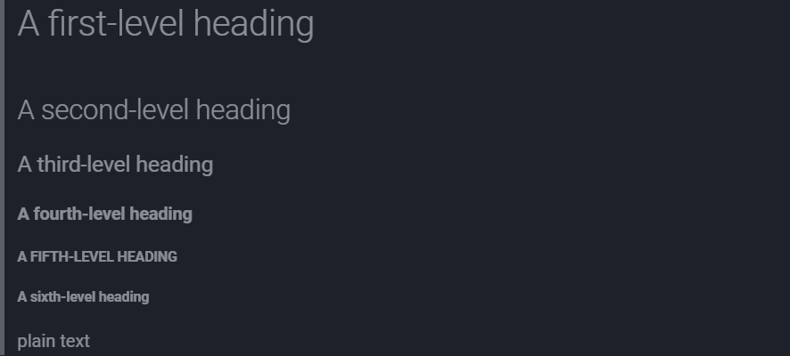

# Basic writing and formatting syntax

Create a sophisticated formatting for your prose and code on GitHub with simple syntax.

## Headings

To create a heading, add one to six `#` symbols before your heading text. The number of `#` you use will determine the hierarchy level and typeface size of the heading.

```
# A first-level heading
## A second-level heading
### A third-level heading
#### A fourth-level heading
##### A fifth-level heading
###### A sixth-level heading
```

<!--This is the same as -->

## Styling text

You can indicate emphasis with bold, italic, strikethrough, subscript or superscript text in commment fields and `.md` files.

 |                  Style |             Syntax |                                 Keyboard shortcut |                                  Example |                                 Output |
 | ---------------------: | -----------------: | ------------------------------------------------: | ---------------------------------------: | -------------------------------------: |
 |                   Bold | `** **` or `__ __` | `Command`+`B` (Mac) or `Ctrl`+`B` (Windows/Linux) |                  `**This is bold text**` |                  __This is bold text__ |
 |                 Italic |     `* *` or `_ _` | `Command`+`I` (Mac) or `Ctrl`+`I` (Windows/Linux) |              `_This text is italicized_` |              *This text is italicized* |
 |          Strikethrough |            `~~ ~~` |                                              None |             `~~This was mistaken text~~` |           ~~This was mistaken text~~\* |
 | Bold and nested italic |  `** **` and `_ _` |                                              None | `**This text is _extremely_ important**` | __This text is *extremely* important__ |
 |    All bold and italic |          `*** ***` |                                              None |       `***All this text is important***` |       _**All this text is important**_ |
 |              Subscript |     `<sub> </sub>` |                                              None |     `This is a <sub>subscipt</sub> text` |     This is a<sub>subscript</sub> text |
 |            Superscript |     `<sup> </sup>` |                                              None |  `This is a <sup>superscript</sup> text` |   This is a<sup>superscript</sup> text |

> \*: I don't know why mkdocs doesn't support using `~~ ~~` to apply the strikethrough effect. Maybe this is not compatible with my material theme.

We can use the HTML `<del>` tag to apply the strikethrough effect.

|         Style |         Syntax | Keyboard shortcut |                             Example | Output                            |
| ------------: | -------------: | ----------------: | ----------------------------------: | --------------------------------- |
| Strikethrough | `<del> </del>` |              None | `<del>This was mistaken text</del>` | <del>This was mistaken text</del> |

## Quoting text

You can quote text with a `>`.

```
Text that is not a quote

> Text that is a quote
```

Quoted text is indented, with a different type color.

Text that is not a quote.

> Text that is a quote

> This is a multi-line quote
>
> Second line

> Text that is a quote
>
> This is a multi-line quote
>
> Second line

>__The text with the quote will be formatted__

You can add another quote in a quote just like this:

> This is the quote
> 
> >This is quote in the quote
> 
> This is the quote
>
> > > This is quote in the quote of the quote
> 
> > This is quote in the quote
>
> This is the quote
>
> > This is quote in the quote
>
> > > This is quote in the quote of the quote
> 
> This is the quote
>
> > This is quote in the quote
>
> This is the quote
>
> > > This is quote in the quote of the quote
>
> This is the qupte

## Quoting code

You can call out code or a command within a sentence with single baketicks. **The text within the backticks will not be formatted.** You can also press the `Command`+`E` (Mac) or `Ctrl`+`E` (Windows/Linux) keyboard shortcut to insert the backticks for a code block within a line of Markdown.

```
Use `git status` to list all new or modified files that haven't yet been committed.
```

Use `git status` to list all new or modified files that haven't yet been committed.

To format code or text into its own distinct block, use triple backticks.

> Some basic Git commands are:
>
> \`\`\`
>
> git status
>
> git add
>
> git commit
>
> \`\`\`

__Some basic Git commands are:__

```bash
git status
git add
git commit
```

## Supported color models

> This feature is only available on GitHub, it will not work on MkDocs

In issues, pull requests and discussions, you can call out colors within a sentence by using backticks. A supported color model within backticks will display a visualization of the color.

```
The background color is `#ffffff` for light mode and `#000000` for dark mode.
```

The background color is `#ffffff` for light mode and `#000000` for dark mode.

Here are the currently supported color models.

| Color |         Syntax |                Example | Output               |
| ----: | -------------: | ---------------------: | -------------------- |
|   HEX |    \`#RRGGBB\` |            \`#0969DA\` | `#0969DA`            |
|   RGB | \`rgb(R,G,B)\` |   \`rgb(9, 105, 218)\` | `rgb(9, 105, 218)`   |
|   HSL | \`hsl(H,S,L)\` | \`hsl(212, 92%, 45%)\` | `hsl(212, 92%, 45%)` |

> Note:
> 
> - A supported color model cannot have any leading or trailing spaces within the backticks.
> 
> - The visualization of the color supported in issues, pull requests, and discussions on GitHub.

## Links

You can create an inline link by warpping link in brackets `[ ]`, and the wrapping the URL in parentheses `( )`. You can also use the keyboard shortcut `Command`+`K` to create a link. When you have text selected, you can paste a URL from your clipboard to automatically create a link from the selection.

You can also create Markdown hyperlink by highlighting the text and using the keyboard shortcut `Command`+`V`. If you'd like to replace the text with the link, use the shortcut `Command`+`Shift`+`V`.

`This site was built using [GitHub Pages](https://pages.github.com/).`

This site was built using [GitHub Pages](https://pages.github.com/).

## Section links

You can link directly to a section in a rendered file by hovering over the section heading to expose :link:.

## Relative links

You can define relative links and image paths in your rendered files to help readers navigate to other files in your repository.

A relative link is a link that is relative to the current file. For example, if you have a README file in root of your repository, and you have another file in *docs/CONTRIBUTING.md*, the relative link to *CONTRIBUTING.md* in your README might look like this:

`[Contribution guidelines for this project](docs/CONTRIBUTING.md)`

GitHub will automatically transform your relative link or image path based on whatever branch you're currently on, so that the link or path always works. The path of the link will be relative to the current file. **Links starting with `/` will be relative to the repository root. You can use all relative link operands, such as `./` and `../`.**

> `/` represents the root of the repository
> 
> `./` represents the current path
>
> `../` represents the parent path of the current path
>
> When there is no link operands ahead, it is the same as the link starting with `./`
> 
> - Example: `docs/CONTRIBUTING.md` is equivalent to `./docs/CONTRIBUTING.md`
> 
> When you are currently at the root of the repository, these three links are equivalent:
> 
> - `docs/CONTRIBUTING.md`(Current is the root)
> - `./docs/CONTRIBUTING.md`(Same as the last one)
> - `/docs/CONTRIBUTING.md`(Root is current)
> 
> In other cases, `docs/CONTRIBUTING.md` and `/docs/CONTRIBUTING.md` point to different paths, they are not equvalent

Your link text should be on a single line. The example below will not work.

```
[Contribution 
guidelines for this project](docs/CONTRIBUTING.md)
```

Relative links are easier for users who clone your repository. Absolute links may not work in clones of your repository - we recommend using relative links to refer to other files within your repository.

## Images

You can display an image by adding `!` and wrapping the alt text in `[ ]`. Alt text is a short text equivalent of the information in the image. Then, wrap the link for the image in parentheses `( )`.

``


> Note: When you want to display an image that is in your repository, use relative links instead of absolute links.

Here are some examples for using relative links to display an image.

|                                                     Context | Relative Link                                                          |
| ----------------------------------------------------------: | ---------------------------------------------------------------------- |
|                          In a `.md` file on the same branch | `/assets/images/electrocat.png`                                        |
|                           In a `.md` file on another branch | `/../main/assets/images/electrocat.png`                                |
|     In issues, pull requests and comments of the repository | `../blob/main/assets/images/electrocat.png?raw=true`                   |
|                       In a `.md` file in another repository | `/../../../../github/docs/blob/main/assets/images/electrocat.png`      |
| In issues, pull requests and comments of another repository | `../../../github/docs/blob/main/assets/images/electrocat.png?raw=true` |

> Note: The last two relative links in the table above will work for images in a private repository only if the viewer has at least read access to the private repository that contains these images.

## Specifying the theme an image is shown to

<picture>
  <source media="(prefers-color-scheme: dark)" srcset="https://user-images.githubusercontent.com/25423296/163456776-7f95b81a-f1ed-45f7-b7ab-8fa810d529fa.png">
  <source media="(prefers-color-scheme: light)" srcset="https://user-images.githubusercontent.com/25423296/163456779-a8556205-d0a5-45e2-ac17-42d089e3c3f8.png">
  
</picture>

If your system theme is dark, then you will see a moon with stars above; otherwise, you will see a sun.

What you see only depends on your system settings. Changing the theme of the page by clicking the button at the head of the page will not affect the image above.

The sun and the moon are diaplayed down below:


## Lists

You can make an unordered list by preceding one or more lines of text with `-`, `*`, or `+`.

```
- George Washington
* John Adams
+ Thomas Jefferson
```

- George Washington
* John Adams
+ Thomas Jefferson

To order your list, precede each line with a number.

```
1. James Madison
2. James Monroe
3. John Quincy Adams
```

1. James Madison
2. James Monroe
3. John Quincy Adams

## Nested Lists

You can create a nested list by indenting one or more list items below another item.

To create a nested list using the web editor on GitHub or a text editor that uses a monospaced font, like Visual Studio Code, you can align your list visually. Type space characters in front of your nested list item until the list marker character (`-` or `*`) lies directly below the first character of the text in the item above it.

```
1. First list item
   - First nested list item
     - Second nested list item
```

> Note: In the web-based editor, you can indent or dedent one or more lines of text by first highlighting the desired lines and then using Tab or Shift+Tab respectively.


1. First list item
   - First nested list item
     - Second nested list item

For more examples, see the [GitHub Flavored Markdown Spec](https://github.github.com/gfm/#example-265).

## Task lists

> This feature is only available on GitHub, it will not work on MkDocs

To create a task list, preface list items with a **hyphen (-)** and space followed by `[ ]`. To mark a task as complete, use `[x]` or `[X]`.

```
- [x] #739
- [ ] https://github.com/octo-org/octo-repo/issues/740
- [ ] Add delight to the experience when all tasks are complete :tada:
```

- [x] #739
- [ ] https://github.com/octo-org/octo-repo/issues/740
- [ ] Add delight to the experience when all tasks are complete :tada:

If a task list item description begins with a parenthesis, you'll need to escape it with \:

`- [ ] \(Optional) Open a followup issue`

## Referencing issues and pull requests

> This feature is only available on GitHub, it will not work on MkDocs

@cmw15004431816

## Referencing issues and pull requests

> This feature is only available on GitHub, it will not work on MkDocs

You can bring up a list of suggested issues and pull requests within the repository by typing `#`. Type the issue or pull request number or title to filter the list, and then press either tab or enter to complete the highlighted result.

## Referencing external resources

If custom autolink references are configured for a repository, then references to external resources, like a JIRA issue or Zendesk ticket, convert into shortened links. To know which autolinks are available in your repository, contact someone with admin permissions to the repository.

## Uploading assets

You can upload assets like images by dragging and dropping, selecting from a file browser, or pasting. You can upload assets to issues, pull requests, comments, and `.md` files in your repository.

## Using emojis

You can add emoji to your writing by typing `:EMOJICODE:`, a colon followed by the name of the emoji.

`@octocat :+1: This PR looks great - it's ready to merge! :shipit:`

@octocat :+1: This PR looks great - it's ready to merge! :shipit:

> GitHub and MkDocs support different emojis
>
> For GitHub emojis, please refer to [this link](https://github.com/ikatyang/emoji-cheat-sheet/blob/master/README.md).
>
> For MkDocs emojis, please refer to [this link](https://squidfunk.github.io/mkdocs-material/reference/icons-emojis/#search).

## Paragraphs

You can create a new paragraph by leaving a blank line between lines of text.

## Footnotes

> This feature is only available on GitHub, it will not work on MkDocs

You can add footnotes to your content by using this bracket syntax:

```
Here is a simple footnote[^1].

A footnote can also have multiple lines[^2].

[^1]: My reference.
[^2]: To add line breaks within a footnote, prefix new lines with 2 spaces.
  This is a second line.
```
The footnote will render like this:


> Note: The position of a footnote in your Markdown does not influence where the footnote will be rendered. You can write a footnote right after your reference to the footnote, and the footnote will still render at the bottom of the Markdown.
> 
> Footnotes are not supported in wikis.

## Alerts

> This feature is only available on GitHub, it will not work on MkDocs

Alerts are a Markdown extension based on the blockquote syntax that you can use to emphasize critical information. On GitHub, they are displayed with distinctive colors and icons to indicate the significance of the content.

Use alerts only when they are crucial for user success and limit them to one or two per article to prevent overloading the reader. Additionally, you should avoid placing alerts consecutively. **Alerts cannot be nested within other elements.**

To add an alert, use a special blockquote line specifying the alert type, followed by the alert information in a standard blockquote. Five types of alerts are available:

```
> [!NOTE]
> Useful information that users should know, even when skimming content.

> [!TIP]
> Helpful advice for doing things better or more easily.

> [!IMPORTANT]
> Key information users need to know to achieve their goal.

> [!WARNING]
> Urgent info that needs immediate user attention to avoid problems.

> [!CAUTION]
> Advises about risks or negative outcomes of certain actions.
```

Here are the rendered alerts:


## Hiding content with comments

You can tell GitHub to hide content from the rendered Markdown by placing the content in an HTML comment

`<!-- This content will not appear in the rendered Markdown --->`

<!-- This content will not appear in the rendered Markdown --->

## Ignoring Markdown formatting

You can tell GitHub to ignore (or escape) Markdown formatting by using `\` before the Markdown character.

`Let's rename \*our-new-project\* to \*our-old-project\*.`

Let's rename \*our-new-project\* to \*our-old-project\*.

For more information on backslashes, see Daring Fireball's "[Markdown Syntax](https://daringfireball.net/projects/markdown/syntax#backslash)"

> Note: The Markdown formatting will not be ignored in the title of an issue or a pull request.

## Disabling Markdown renderinbg

When viewing a Markdown file, you can click **Code** at the top of the file to disable Markdown rendering and view the file's source instead.


Disabling Markdown rendering enables you to use source view features, such as line linking, which is not possible when viewinbg rendered Markdown files.

---

This article is created from [GitHub Docs](https://docs.github.com/en/get-started/writing-on-github/getting-started-with-writing-and-formatting-on-github/basic-writing-and-formatting-syntax). 

The author has made some edits.

Author: Morgan Willow Chen

Last updated 07/03/2024
