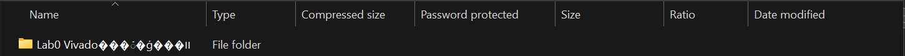
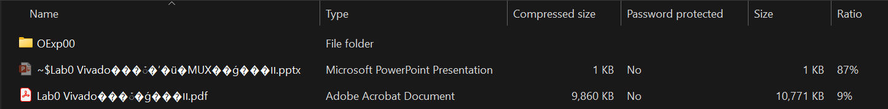
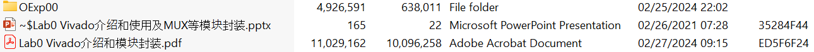
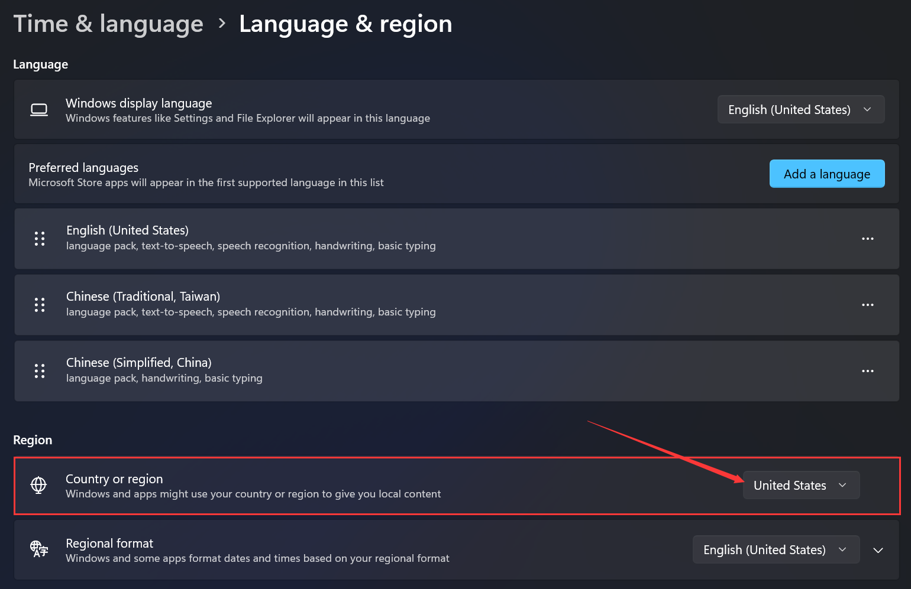
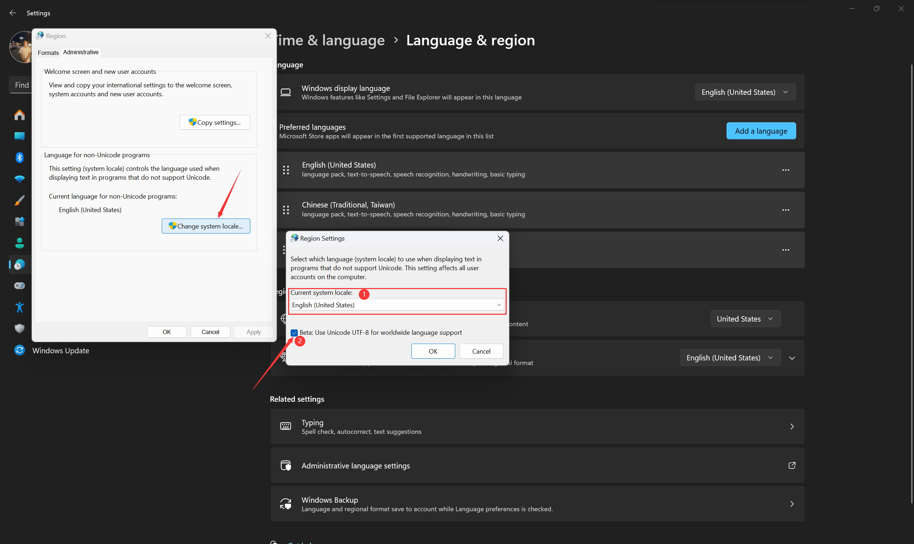
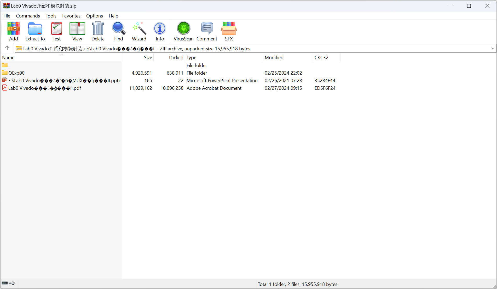
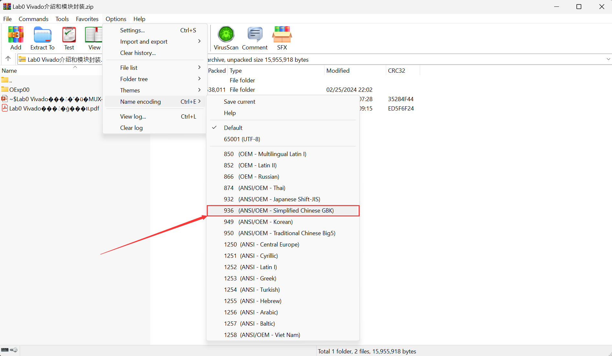
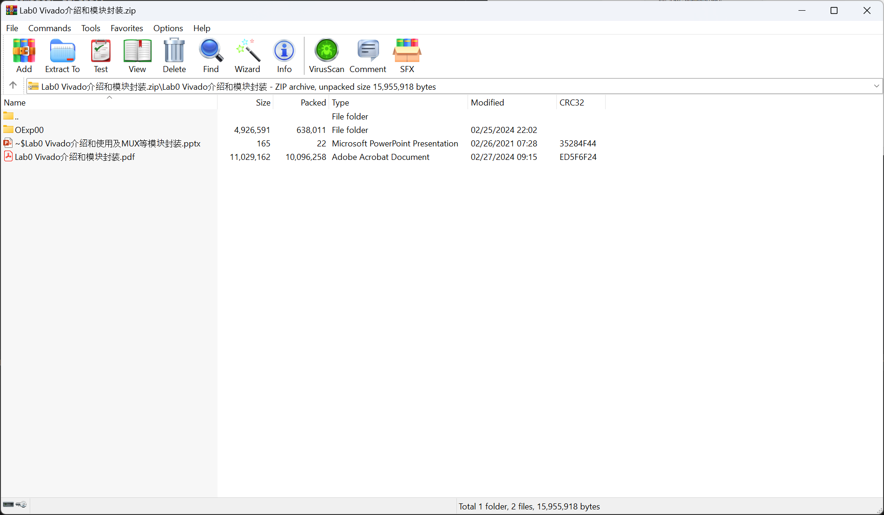

# Garbled compressed file names

## Background

You must know that I am a multi-language user. I worked in Chinese (Traditional), Chinese (Simplified), and English, and you must understand that characters in different languages use different encodings in computer systems. Today I encountered a garbled compressed file name problem. My friend sent me a zipped file that contains Chinese (Simplified) characters in the file names. That's where the problem lies.

## How does the problem look like

This is the zipped file that my friend sent to me.

Looks fine, right? Let's double-click it, and you will see this:

What is the file name??? Lab0 Vivado���ܺ�ģ���װ? Let's move in, and you will see this:

I asked my friend and the name displayed on her screen was like this:

I understand that there must be something wrong with my Windows display - Every Chinese (Simplified) character is garbled in the file name.

## How I solved the problem

After getting to know that it is my problem, it's time to find a way to solve it.

I found that the problem is caused by the different encodings.

The **country or region** of my friend's computer is **China** while mine is **United States**.

Our computer system uses different encodings while they are not compatible.

### First way (not recommended)

Just change your **country or region** to **China** and every Chinese (Simplified) character should be displayed correctly.

Or you can click the **Administrative language settings** in the **related settings** section and change **system locate** to **China** (1 in the next screenshot). 

Someone also mentioned that checking the **Beta: Use Unicode UTF-8 for worldwide language support** checkbox (2 in the screenshot above) and **restart your PC** can also help but it didn't work for me.

### Second way

At some time, maybe we don't want to change the **country or region** setting in our system, then we can use a third-party software to help us instead of using Windows File Explorer.

Here I recommend [WinRAR](https://www.win-rar.com/start.html?&L=0), the world’s most popular compression tool. You may have it installed on your computer already.

Use WinRAR to open the zip file, you will see this:

We knew that the source encoding is Simplified Chinese, so click **Options**, in the **Name encoding** (or click the shortcut key `Ctrl` + `E`) section, select **936 (ANSI/OEM - Simplified Chinese GBK)** -

-and you will find the Chinese (Simplified) characters are rendered normally. After extracting the zip file in WinRAR, the file names are also correct.

## Generalize the problem

We have solved the Chinese (Simplified) problem, and for other languages, the problem can be solved accordingly.

First, you need to get to know the **country or region** setting on the computer which is used to compress the zip file.

If you use the [First way](#first-way-not-recommend), just change your **country or region** to match the source computer. If you don't know, you can just ask your friend who sent the zipped file to you. For the [second way](#second-way) you can select encoding in WinRAR according to the **country or region** setting of the source computer or try every encoding in WinRAR until the file names are displayed correctly.

!!! note
 The encoding you should choose depends on the **country or region** setting of the source computer, instead of the actual language of the file name.

I will give some examples down below:

| Country or region |        Encoding you should choose         |
| :---------------: | :---------------------------------------: |
|   United States   |               65001 (UTF-8)               |
|      Taiwan       | 950 (ANSI/OEM - Traditional Chinese Big5) |
|       China       |  936 (ANSI/OEM - Simplified Chinese GBK)  |

For example, if my computer's country or region is `United States` and I send a zip file to my friend, then my friend should select `65001 (UTF-8)` to view the file names correctly **although my file names contain Chinese (Traditional) character, instead of selecting `950 (ANSI/OEM - Traditional Chinese Big5)`**. If you selected the wrong encoding, you will see the garbled file names.

---

Author: Morgan Willow Chen

Last updated 09/08/2024
