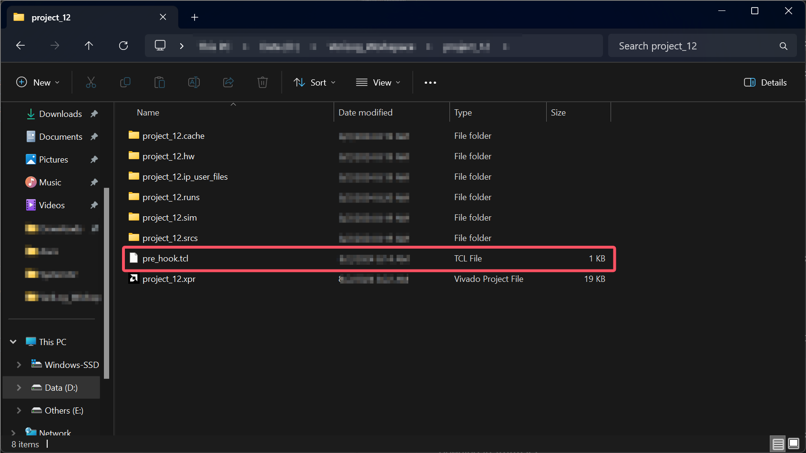
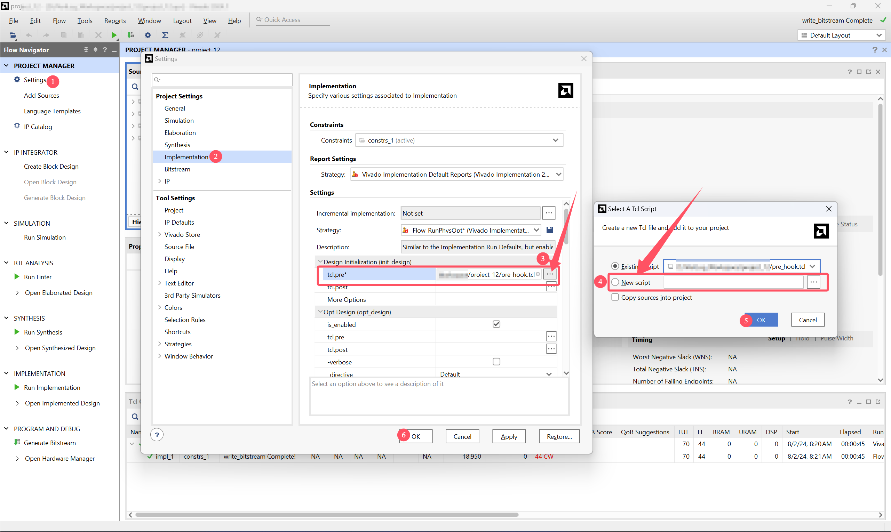

# How to suppress the DRC errors in VIVADO 2024.1

!!! Warning
    ${\color{red}\text{Before you follow my instructions, you should get a full understanding of the risks of doing this.}}$
    
    If you are not sure about the risks, first read the [Appendix](#appendix-risks-of-suppressing-drc-errors) section of this blog.

## Background

I have been using the VIVADO 2023.2 version for development. But I upgraded to its 2024.1 version recently.

When developing with a board whose pins are limited in amount, sometimes there are not enough pins for you to configure in the constraints file.

## What error did I encounter and why did it appear

If you specified the `reg`/`wire` in the `input` file, but you didn't specify its constraints in the constraints file accordingly, then you will encounter some error messages. Detailedly, it is:

You will not encounter any error in the `Synthesis` process and `Implementation` process.

But when you run the `Generate Bitstream` process, you will encounter some error messages like this:

> [DRC NSTD-1] Unspecified I/O Standard: 20 out of 48 logical ports use I/O standard (IOSTANDARD) value 'DEFAULT', instead of a user assigned specific value. This may cause I/O contention or incompatibility with the board power or connectivity affecting performance, signal integrity or in extreme cases cause damage to the device or the components to which it is connected. To correct this violation, specify all I/O standards. This design will fail to generate a bitstream unless all logical ports have a user specified I/O standard value defined. To allow bitstream creation with unspecified I/O standard values (not recommended), use this command: set_property SEVERITY {Warning} [get_drc_checks NSTD-1].  NOTE: When using the Vivado Runs infrastructure (e.g. launch_runs Tcl command), add this command to a .tcl file and add that file as a pre-hook for write_bitstream step for the implementation run. Problem ports: res[3:0], rreg1[3:0], rreg2[3:0], rreg3[3:0], and rreg4[3:0].

You will receive two error messages in total. The one above is about the `NSTD`, and another one is about `UCIO`, which is very similar to the `NSTD` error message.

The error messages will be thrown during the `DRC` process.

## How can you solve the error according to the error message

### Following the instructions in the error message

In the error message, it gave us the first solution: `To correct this violation, specify all I/O standards.`

You can add the missing pins to the constraints file and give them a specific value, but this is not possible in our case.

Our board is limited and it does not have enough pins for us to use, so this solution will fail.

<a id="1"></a>
So you only have the second solution - **suppressing the DRC error**: `To allow bitstream creation with unspecified I/O standard values (not recommended), use this command: set_property SEVERITY {Warning} [get_drc_checks NSTD-1].`

For specific step, you need: `NOTE: When using the Vivado Runs infrastructure (e.g. launch_runs Tcl command), add this command to a .tcl file and add that file as a pre-hook for write_bitstream step for the implementation run.`

There are two *important* parts in the second solution, the first one is the command: `set_property SEVERITY {Warning} [get_drc_checks NSTD-1]` and the other one is `add this command to a .tcl file and add that file as a pre-hook for write_bitstream step for the implementation run`.

But this message didn't guide you very detailedly. If it is the first time you have encountered the error, you may need a step-by-step instruction. So I threw the error message to ChatGPT.

### Helped by ChatGPT

ChatGPT gave me detailed instructions but only two of the ways it gave me are useful.

I would like to give two ways that may be useful.

#### First:

For the `NSTD` error, use this line: `set_property SEVERITY {Info} [get_drc_checks NSTD-1]`.

For the `UCIO` error, use this line: `set_property SEVERITY {Info} [get_drc_checks UCIO-1]`.

You can add these two lines to the **top** of your original constraints `.xdc` file.

```tcl
set_property SEVERITY {Info} [get_drc_checks NSTD-1]
set_property SEVERITY {Info} [get_drc_checks UCIO-1]
```

This is the easiest way which may be efficient.

This works in the VIVADO 2023.2 version, but **DOES NOT WORK** in the 2024.1 version.

If you are using 2024.1 version, then you must use the second way, which may be a little more complicated.

#### Second:

In the first place, you need to create a file. Name it to `pre_hook.tcl`. It contains these contents:

```tcl
set_property SEVERITY {Info} [get_drc_checks NSTD-1]
set_property SEVERITY {Info} [get_drc_checks UCIO-1]
```

I will recommend you to put the `pre_hook.tcl` file under the project directory which you are currently opening in VIVADO.



Next, go to VIVADO. Look at the left sidebar. Under the `Project Manager` click `Settings`. In the `Project Settings` section, click the `Implementation`. Under `Settings`, find `Design Intialization (init_design)` and click :material-dots-horizontal: at the left of the `tcl.pre` section:



After that, you can try `Generate Bitstream`, and the problem should be solved.

!!! Warning
    [Allowing bitstream creation with unspecified I/O standard values (suppressing the DRC error)](#1) is not recommended. ${\color{red}\text{Only follow my instructions after fully understanding the risks.}}$

## Appendix: Risks of suppressing DRC errors

> This section is generated by ChatGPT.

Suppressing DRC (Design Rule Check) errors in VIVADO or any other FPGA design tool is generally not recommended for several reasons. DRC errors are there to ensure that your design complies with the electrical and logical constraints necessary for proper operation. Ignoring or suppressing these errors can lead to various issues, which may include:

1. Risk of Hardware Damage
    - I/O Standard Mismatch: If the I/O standard is not correctly specified, there could be voltage level mismatches between the FPGA and the connected hardware components. This can potentially damage the FPGA, the peripheral devices, or both.

    - Overcurrent Conditions: Incorrect I/O standards can lead to overcurrent conditions, possibly damaging the FPGA pins or causing overheating.

2. Signal Integrity Issues
    - Reflection and Crosstalk: Improper I/O standards can lead to signal integrity issues such as reflections and crosstalk, especially at high frequencies. This can result in data corruption and unreliable communication between components.

    - Impedance Mismatch: Mismatched impedance can cause signal degradation, affecting the performance of high-speed signals.

3. Functional Failures
    - Incorrect Logic Levels: Without proper I/O standards, the FPGA may not interpret incoming signals correctly, leading to logical errors in the design.

    - Unpredictable Behavior: Suppressing DRC errors can lead to unpredictable behavior during operation, making it difficult to diagnose and fix issues later.

4. Poor Performance
    - Timing Violations: Incorrect settings may lead to timing violations that degrade the overall performance of the FPGA, causing it to run slower than intended.

    - Power Consumption: Misconfigured I/O standards can increase power consumption, leading to thermal issues and reduced efficiency.

5. Design Compliance
    - Failure to Meet Specifications: Suppressing errors can result in a design that does not meet industry or application-specific standards, potentially violating compliance requirements.

    - Non-Optimal Resource Usage: Incorrect settings can lead to suboptimal utilization of the FPGA's resources, affecting the performance and scalability of your design.

6. Debugging Challenges
    - Difficult to Diagnose: Suppressed errors can mask underlying issues that may only become apparent during testing or deployment, making it difficult to diagnose and resolve problems.

    - Increased Debugging Time: If issues arise later in the design process, it may take significantly more time to identify and correct them, increasing development costs and delays.

**When to Consider Suppressing DRC Errors**

In certain situations, you may consider suppressing DRC errors, but these should be carefully evaluated:

1. Prototyping and Testing: If you are in a prototyping phase and aware of the risks, suppressing certain DRC errors may be acceptable for quick iterations. However, this should not be a permanent solution.

2. Well-Understood Exceptions: If the DRC error pertains to a known and well-understood issue that does not affect your specific application, you might suppress it temporarily. Even in such cases, documenting the reasons and potential risks is crucial.

3. Internal Use: If the design is for internal use and you have full control over the deployment environment, you might take calculated risks with suppressing certain checks.

**Conclusion**

While suppressing DRC errors might be tempting to quickly move forward in the design process, it's important to consider the potential consequences. Careful analysis and testing should accompany any decision to suppress DRC errors, and efforts should be made to resolve the underlying issues instead. Proper design practices and adherence to DRC guidelines are crucial for achieving a reliable and high-performance FPGA implementation.
